美国国家运输安全委员会（National Transportation Safety Board）  
研究与工程办公室（Office of Research and Engineering）  
华盛顿特区 20594  

DCA22WA102  

# 驾驶舱语音与飞行数据记录器报告（Cockpit Voice and Flight Data Recorder）
综合下载报告（Combined Download Report）  
2022年7月1日  

---

> *Disclaimer*  

> *The Chinese text provided here is an unofficial translation of*  
> *materials published by the National Transportation Safety Board*  
> *(NTSB).*  

> *The original English version is the only authoritative source. This*  
> *translation may contain errors or inaccuracies.*  

> *The translator makes no representations or warranties regarding the*  
> *accuracy or completeness of this translation and assumes no*  
> *responsibility for any consequences arising from its use.*  

> *License*  

> *The original NTSB report is a work of the United States Government*  
> *and is in the public domain.*  

> *This Chinese translation is released under the Creative Commons*  
> *Attribution 4.0 International (CC BY 4.0) license.*  

> *Attribution*  

> *If you use this translation, please provide attribution as follows:*  

> *Chinese translation by `wrongly-cuddly-obsession` and `adminlby`*  
> *Source: https://github.com/adminlby/NTSB_FOIA_MU5735* 

> *Attribution must not suggest endorsement by the translator.*  

---

## A. 事故情况（ACCIDENT）

地点： 中国梧州   
日期： 2022年3月21日  
时间： 06:30 UTC  
飞机： 波音 737-800，中国东方航空，注册号 B-1791  

## B. 驾驶舱语音与飞行数据记录器数据恢复组（COCKPIT VOICE AND FLIGHT DATA RECORDER DATA RECOVERY GROUP）

报告作者  
Charles Cates  
机械工程师 / 记录器专家  
美国国家运输安全委员会（NTSB）

小组成员  
Xiangdong Wan  
小组负责人，CAAC 首席飞行员  
中国民用航空局（CAAC）

小组成员  
Hang Lin  
事故调查负责人  
中国民用航空局（CAAC）

小组成员  
Yu Zhang  
调查员  
中国民用航空局（CAAC）

小组成员  
Liling Yu  
实验室工程师  
中国民用航空局（CAAC）

小组成员  
Xin Miao  
实验室工程师  
中国民用航空局（CAAC）

小组成员  
Chun Wang  
实验室工程师  
中国民用航空局（CAAC）

主题专家  
Joseph Gregor, Ph.D.
电气工程师 / 记录器专家  
美国国家运输安全委员会（NTSB）

主题专家  
R. Greg Smith  
分部主管，记录器分部 (Blue)  
美国国家运输安全委员会（NTSB）

专家  
W. Deven Chen  
电气工程师 / 记录器专家  
美国国家运输安全委员会（NTSB）

## C. 调查细节（DETAILS OF THE INVESTIGATION）

数据恢复工作组于2022年3月28日成立，由中国民用航空局（CAAC）和美国国家运输安全委员会（NTSB）的代表组成。NTSB飞行记录器部门接收了驾驶舱语音记录器（CVR）和飞行数据记录器（FDR）的存储模块。对存储设备的处理由NTSB人员执行，并由CAAC人员进行监督和记录。提供给NTSB的记录器存储模块如下：

- 记录器制造商/型号：Honeywell HFR5-V CVR  
  部件号：980-6032-001  
  记录器序列号：CVR-04014  

- 记录器制造商/型号：Honeywell HFR5-D FDR  
  部件号：980-4750-009  
  记录器序列号：FDR-02952  

## D. 数据恢复（DATA RECOVERY）

对受损飞行数据记录器的数据恢复是一个系统化过程，包括评估、修复和数据读取。首要任务是在最大程度避免数据丢失或损坏的前提下恢复存储数据。

严重受损的硬件尤其具有挑战性，因为在通电时可能发生短路或对电路板组件造成进一步损坏，从而导致数据丢失。因此，在尝试读取数据之前，对各组件进行仔细处理和全面检查至关重要，这有助于识别和记录损伤情况，从而制定系统性的修复和恢复方案。

使用专门设计用于恢复受损硬件的数据恢复工具，对于保持记录数据的完整性至关重要。这些工具包括用于连接和读取的硬件设备（如电缆和读取底座），以及专用的数据恢复软件。

## 1.0 HFR5-V驾驶舱语音记录器说明（HFR5-V CVR Description）

### 1.0 HFR5-V驾驶舱语音记录器说明（HFR5-V CVR Description）

Honeywell HFR5-V型驾驶舱语音记录器可记录四个通道的高质量音频信息，这些音频来源包括机长音频面板、副驾驶音频面板、驾驶舱观察员音频面板以及驾驶舱区域麦克风（CAM）。数字录音数据存储在固态存储模块中。来自音频面板的各通道可记录两小时音频，而CAM通道可记录三小时音频。HFR5-V的设计符合EUROCAE标准ED-112A中规定的抗坠毁性能要求。

### 1.1 HFR5-V驾驶舱语音记录器损伤情况（HFR5-V CVR Damage）

据报告，该CVR的抗坠毁存储单元（CSMU）于2022年3月23日从飞机残骸中被回收。记录器因撞击力严重受损。CSMU在北京的中国民用航空局（CAAC）设施内被拆解，存储模块被取出。用于保护存储板电路组件（CCA）的红色室温硫化（RTV）密封胶被移除，CAAC使用替代记录器机架多次尝试下载设备中的存储数据。据报告，在数据解压过程中软件提示了大量错误，且所有尝试均未能生成可识别的`.wav`音频文件。

### 1.2 HFR5-V驾驶舱语音记录器数据恢复（HFR5-V CVR Recovery）

2022年3月28日，在CVR抵达NTSB之前的一次下载尝试中，NTSB获得了一个`.dlu`格式的CVR下载文件。该文件在NTSB的CVR实验室中使用Honeywell的记录器恢复软件Playback32进行解压。在解压过程中出现了大量错误。解压结束后生成了四个`.wav`音频文件。这四个文件的长度和采样率符合预期，但在播放时均无法辨识，存在卡顿、回声伪影以及贯穿始终的数字噪声，音频数据不可用。

CVR存储模块被送至NTSB进行显微检查。图1显示电路板的连接器一侧，图2显示其另一侧。两侧均包含存储数据的FLASH存储芯片。初步检查发现，该设备连接器区域存在严重损伤。用于将连接器固定到电路板并提供通往数据芯片电信号路径的多个焊盘被发现弯曲或完全从电路板上脱落。（有关连接器损伤的更多细节和具体情况，参见附件1《CMM恢复报告》。）受损的引脚对应芯片的数据线和地址线。这些损伤对数据下载具有重大影响，并且与数据中出现的音频伪影相一致。芯片数据线的损伤会表现为量化误差类型的数字噪声，而地址线的损伤则会表现为卡顿、回声以及重复类型的噪声。

进一步检查还发现连接器本体的塑料部分发生了轻微变形。电路板一侧的长边高于其正常位置，该边缘的引脚缩入连接器壳体内部。在这种状态下，恢复电缆上的公引脚难以与电路板形成可靠连接。面向存储芯片的一侧长边则被压低至其正常位置以下，引脚明显从连接器壳体中凸出。同时还发现连接器两侧之间的接地层在连接器壳体下方受损，多个区域被切断或从电路板上翘起。图3展示了接收时连接器的状态。

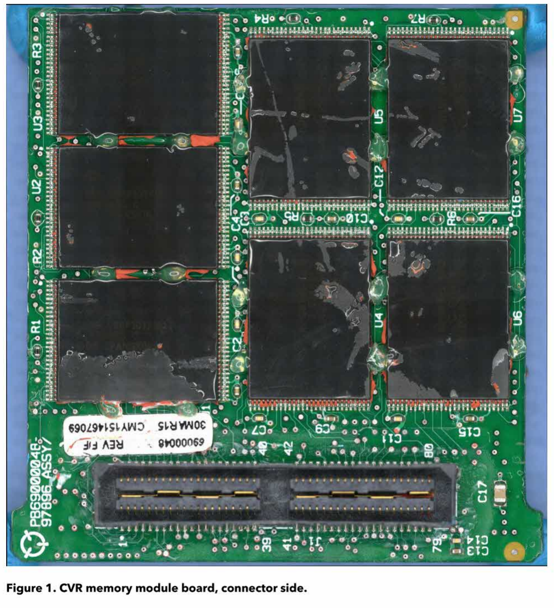
*图1：CVR存储模块电路板，连接器侧*

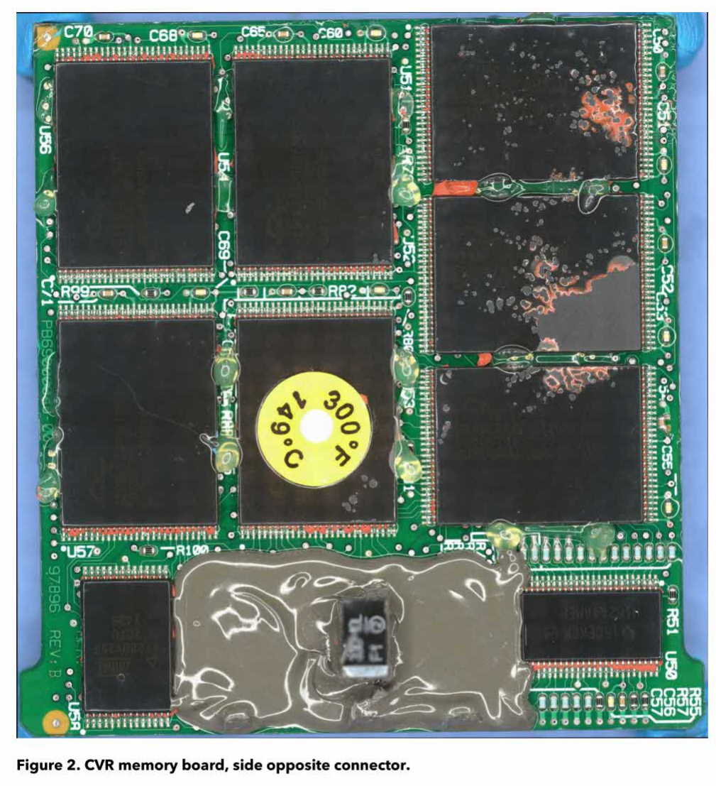
*图2：CVR存储电路板，连接器相对侧*

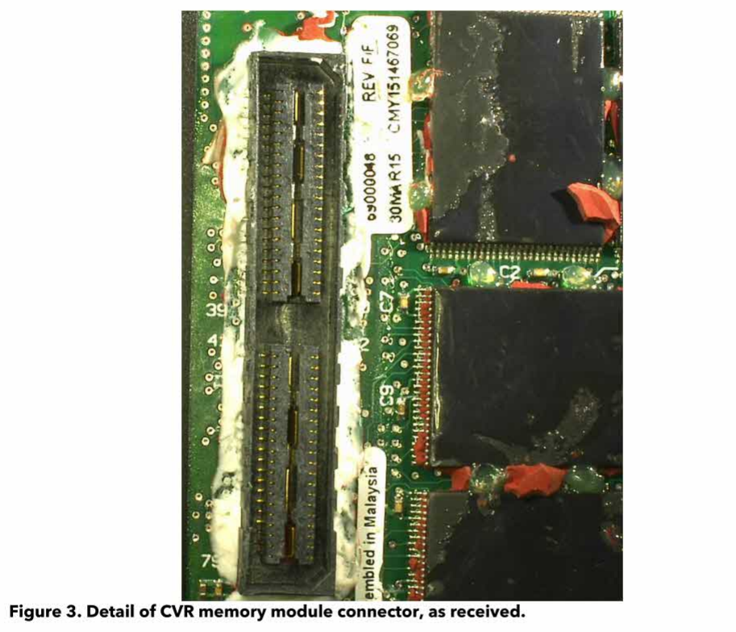
*图3：CVR存储模块连接器细节（接收时状态）*

还发现一个额外异常，被认定为在电路板制造过程中即已存在。一个电容从电路板上翘起，未与焊盘接触，并以这种状态被覆以三防涂层进行封装。这表明该电容从未真正成为设计电路的一部分。对电路板原理图的检查显示，该电容为电源调理电容，用于滤除可能由电源污染引起的频率波动。由于在航空公司执行的电路板出厂测试或持续适航检查中未发现该问题，因此其对CVR性能产生影响的可能性较低。

为完成对电路板的初步检查，对连接器区域残留的RTV密封胶进行了仔细清除。所有可接触到的连接器引脚均进行了完整性物理检测。（部分引脚由于布线位于电路板下方而无法接触。）记录并整理了大量松动或分离的引脚。图4显示了已清除剩余RTV密封胶、准备进行检查的连接器状态。

制定了一项损伤恢复工作方案，旨在在对电路板通电并再次尝试下载数据之前，尽可能安全地修复在初步检查中发现的损伤。对电路板Gerber文件进行了分析，以确定所有关键过孔和存储走线的位置及其布线路径。制定了一项连续性测试，用于检测连接器引脚与FLASH存储芯片之间是否存在隐藏的电气损伤。该测试通过使用一个已知完好的替代存储模块进行了验证。

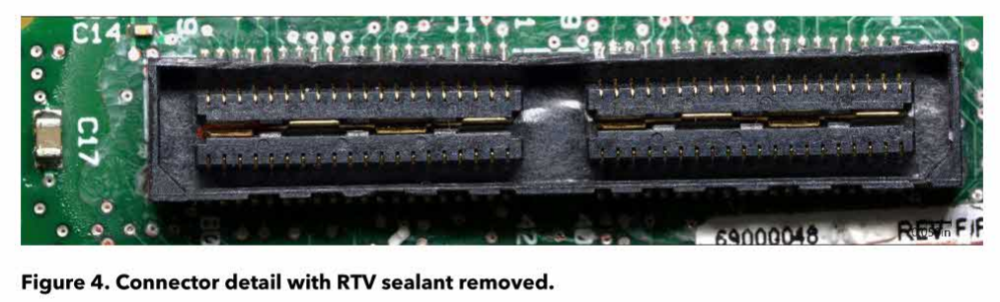
*图4：去除RTV密封胶后的连接器细节*

在检查中发现的松动或分离的引脚通过显微镜和专用氰基丙烯酸酯胶进行了修复。为尽可能改善与受损电路板连接器的接触，改装了一根HFR-5恢复柔性电缆，以增强电缆与电路板之间的可靠连接。电缆上的许多引脚被略微向远离连接器塑料部分的方向弯曲，从而更好地与受损连接器中内缩的引脚接触。

完成上述修复后，将事故记录器的CPM通过改装后的恢复柔性电缆连接，并安装在NTSB的HFR5-V基准机架中。使用Honeywell Playback32软件尝试下载数据，但未能生成可用的`.dlu`文件。

随后在未从基准机架上断开或重新插拔连接器的情况下，使用名为DLDR的工程工具再次进行下载。DLDR可直接读取FLASH存储芯片内容，并将每个芯片的数据写入独立的二进制芯片镜像文件。随后使用另一种名为CHIPS的工程工具，将各芯片镜像按照正确顺序重新组合为完整存储数据，并生成`.dlu`文件。该次下载生成了14个芯片镜像文件（与电路板上的FLASH芯片数量一致），并成功合成为一个`.dlu`文件。Playback32能够从这些数据生成4个`.wav`文件，但在解压过程中产生了大量错误。为验证一致性，又进行了第二次DLDR下载，两次下载之间在文件中分布存在少量单字节差异，其原因未能解释。

生成的`.wav`文件包括三个音频面板通道（采样率为8kHz，每个通道时长为两小时）以及一个CAM通道（采样率为16kHz，时长为三小时）。这些文件被导入CVR监听室进行试听。由于芯片镜像数据的重组方式，这些`.wav`文件中的数据并非按时间顺序排列（即从最早数据顺序排列至最新数据），而是按照数据在芯片上的写入顺序排列，因此最新数据（事故过程）位于文件中部，其后为较早数据。

试听结果显示四个通道均包含可辨识音频。根据NTSB质量评级标准，音频面板通道为“中等（Fair）”质量，CAM通道为“较差（Poor）”质量。所有通道均存在数字噪声和失真，在事故过程部分还观察到音频重复现象。音频数据中的数字伪影与恢复电缆与非易失性存储芯片（NVM）数据线之间的损伤一致，而重复音频现象则与芯片地址线的类似损伤一致。

下载结果进一步证明电路板连接器区域存在损伤，因此开展了进一步检查以识别引脚连接问题。这些检查包括二维和三维X射线成像，以判断存储模块是否存在不可见损伤，并辅以进一步的显微检查。

X射线检查显示，在若干位置上连接器引脚与电路板走线或过孔之间的间隙较小，但该间隙仍表明不太可能引发短路或影响芯片数据线和地址线的信号路径。额外的显微检查未发现其他损伤。

在X射线图像的辅助下，对改装后的恢复带状电缆再次进行调整，以期改善与受损连接器的接触。随后进行了全面的引脚检测，以确保间隙较小的引脚不会对电气信号路径产生影响。之后再次进行了多次数据下载，结果与此前下载基本一致。

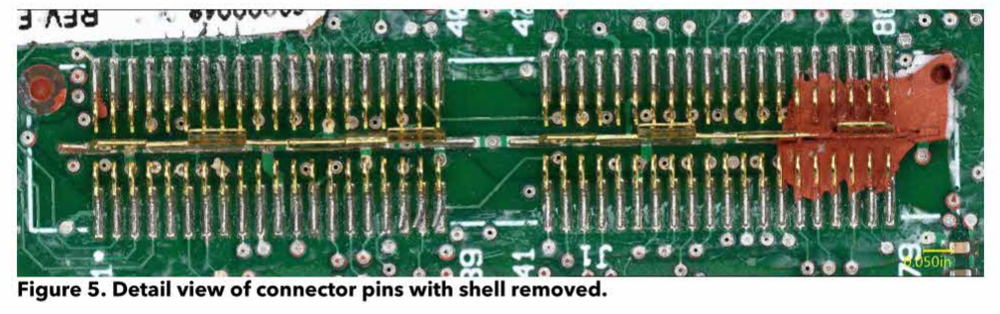
*图5：移除外壳后的连接器引脚细节视图*

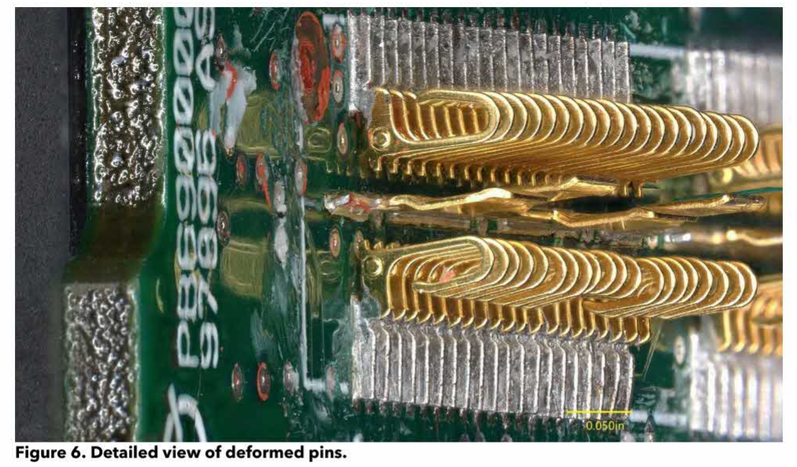
*图6：变形引脚的详细视图*

由于多次下载仅获得较差至中等质量结果，且音频表现与芯片数据线和地址线损伤一致，在尝试修复问题后仍未改善，团队决定应移除并可能更换受损的电路板连接器。确定使用一块NTSB替代电路板作为测试对象，以研究在保留引脚焊接在电路板上的情况下，安全移除连接器外壳塑料部分的工艺。

CVR连接器外壳被完全移除，暴露出原本被塑料覆盖的额外引脚损伤。发现部分引脚被压入塑料下方，同时还有大量焊盘和走线松动或完全从电路板上脱落。很可能部分引脚之所以还能接触，是因为它们被连接器外壳压在电路板上所致。中央接地层在除一个连接点外的所有固定点均已松动。移除连接器外壳后的存储模块如图5所示，引脚的部分变形情况如图6所示。

在移除塑料连接器外壳后，对引脚再次进行加固处理，并使用氰基丙烯酸酯胶对松动区域进行修复并固化。在引脚完全稳定后，开始对其进行细致的重新整形，使其尽可能恢复到原始位置。该过程以替代电路板上的引脚作为参考模板。将引脚尽可能恢复至原始形状，有助于在重新安装连接器外壳后，与恢复电缆形成可靠连接。在重新整形过程中还发现，奇数编号引脚与多个未绝缘的过孔和走线之间的间距极小，这一问题此前被连接器外壳遮蔽。为解决该问题，使用Kapton胶带制作了一条薄绝缘隔离带，并将其放置在引脚与电路板之间。

随后，小心地将新的连接器外壳安装在修复后的引脚上。由于引脚结构非常精细且需要与连接器内的槽位精确对齐，该操作在显微镜下完成。随后将改装后的柔性电缆与电路板连接，并使用ESD胶带进行固定。接着将电路板与柔性电缆组件安装到NTSB的HFR5-V基准机架上，并分别使用Playback32和DLDR进行数据下载。

Playback32下载过程运行正常，未再出现此前下载中观察到的错误。同样，数据解压过程也基本顺利，仅在宽带（CAM）通道解压过程中出现少量错误，而窄带通道未出现错误，且错误数量远低于此前下载过程。Playback32成功生成了4个`.wav`文件，其位深和采样率与此前下载结果一致，符合预期。

将生成的`.wav`文件导入CVR监听室进行试听。文件按时间顺序排列，从最早数据到最近（事故）数据。事故过程已被记录，且根据NTSB音频质量评级标准，所有通道的音频质量均为“优秀（Excellent）”。

对各通道音轨的进一步分析表明，宽带CAM通道与窄带机组音频通道之间存在时间漂移。该漂移并非线性，且在整个两小时的机组通道记录过程中，CAM通道与机组通道之间持续发生偏移。通过选取共同的音频锚点对CAM与机组通道进行同步，可以确定机组通道偶尔存在短时间的数据缺失，这很可能对应于数据恢复过程中个别数字音频数据包的丢失。

对DLDR下载数据同样进行了数据解压，并基于DLDR生成的芯片镜像文件生成了`.wav`文件。随后将这些文件与Playback32生成的`.wav`文件进行直接对比。结果表明，Playback32生成的文件在事件时间序列上更为准确。窄带通道在整个记录过程中存在短时且随机发生的轻微数据丢失。这些伪影可能与初始显微检查中发现的CVR电路板出厂状态下的旁路电容损伤有关，但由于缺乏事故前的对比下载数据，无法确认这一点。

鉴于已获得高质量录音以及CAM通道具备准确的时间序列，确认本次数据下载结果可接受，无需进一步尝试下载或采用更具侵入性的恢复方法。

### 1.3音频记录说明（Audio Recording Description）

最终下载文件中各通道的音频质量和时长见表1。

*表1：音频质量与通道信息*  

| 通道编号 | 内容/来源 | 质量 | 时长 |
|----------|----------|------|------|
| 1 | 驾驶舱观察员音频面板 | 优秀 | 约120分钟 |
| 2 | 副驾驶音频面板 | 优秀 | 约120分钟 |
| 3 | 机长音频面板 | 优秀 | 约120分钟 |
| 4 | 驾驶舱区域麦克风（CAM） | 优秀 | 约180分钟 |

### 1.4提供给CAAC的CVR数据（CVR Data Provided to CAAC）

提供给CAAC代表团的CVR数据包括以下内容：

- 所有下载尝试生成的原始下载文件，包括Playback32和DLDR方式生成的数据  
- 所有DLDR下载尝试生成的原始芯片镜像文件  
- 所有由Playback32以及DLDR/CHIPS生成的`.dlu`文件，包括未能生成有效`.wav`文件的版本  
- 所有下载过程中生成的`.wav`文件  
- 所有经过时间校正的`.wav`文件，以及所有从默认8kHz采样率上采样至与CAM通道16kHz采样率一致的机组音频通道文件  
- 所有由NTSB音频分析工具生成的会话文件（RAPT-R `.mdf`文件）  
- 所有经过降噪和音频增强处理以突出关键音频内容的`.wav`文件  
- 为尽可能匹配机组通道与CAM通道时间轴（考虑前述数据包丢失问题）而进行时间拉伸处理的`.wav`文件  
- 在整个恢复过程中拍摄的所有CVR存储板照片、扫描图像以及显微图像  

除上述照片、扫描图像和显微图像外，NTSB未保留任何提供给CAAC代表团的文件。NTSB未保留任何CVR音频文件，也未保留任何可用于生成音频文件的原始或中间下载数据。

### 2.0 HFR5-D飞行数据记录器说明（HFR5-D FDR Description）

Honeywell HFR5-D型飞行数据记录器以固态FLASH存储器为记录介质，以数字格式记录飞机飞行数据。HFR5-D可接收ARINC573/717/747格式的数据，并可记录至少25小时的飞行数据。其配置为每秒记录512个12位字的数字信息。每512个字（即每秒数据）称为一个子帧。每个子帧包含一个唯一的12位同步字（sync word），用于标识该子帧为子帧1、2、3或4。同步字为每个子帧的第一个字。当连续同步字以正确的512字间隔出现时，数据流即处于“同步”状态。每个数据参数（例如高度、航向、空速）在子帧中均对应一个特定的字位置。HFR5-D的设计符合EUROCAE标准ED-112A中规定的抗坠毁性能要求。

### 2.1 HFR5-D飞行数据记录器损伤情况（HFR5-D FDR Damage）

据报告，该FDR的抗坠毁存储单元（CSMU）于2022年3月27日从飞机残骸中被回收。记录器因撞击力严重受损。CSMU在北京的中国民用航空局（CAAC）设施内被拆解，存储模块被取出。据报告，CAAC曾使用替代FDR机架尝试进行一次数据下载，但未成功。

### 2.2 HFR5-D飞行数据记录器数据恢复（HFR5-D FDR Recovery）

FDR电路板组件（CCA）于2022年4月4日交付NTSB。用于保护存储板CCA的红色RTV密封胶保持完整，仅暴露出FLASH存储器温度指示点以供检查。该温度指示点显示电路板未经历显著高温，且未发现CVR电路板上存在的那类损伤。

NTSB将基准机架重新配置为合适的FDR替代机架，并连接事故存储模块。使用Playback32进行数据下载尝试，但未成功。随后使用DLDR工具对各个FLASH存储芯片进行了多次单独下载。各次下载结果略有差异，但总体上每个FLASH芯片镜像文件均表现为全0数据。

随后移除了FDR存储板上的红色RTV密封胶，以便对整个模块进行初步目视检查。图7和图8分别展示了FDR存储模块的连接器侧和另一侧。在高倍显微镜下检查发现，FLASH芯片U2从封装顶部边缘延伸至芯片中心存在裂纹，该裂纹已贯穿至器件表面的三防涂层。同时，多个用于将芯片固定在电路板上的环氧焊球也出现开裂和/或与原本附着的FLASH器件发生分离的迹象。

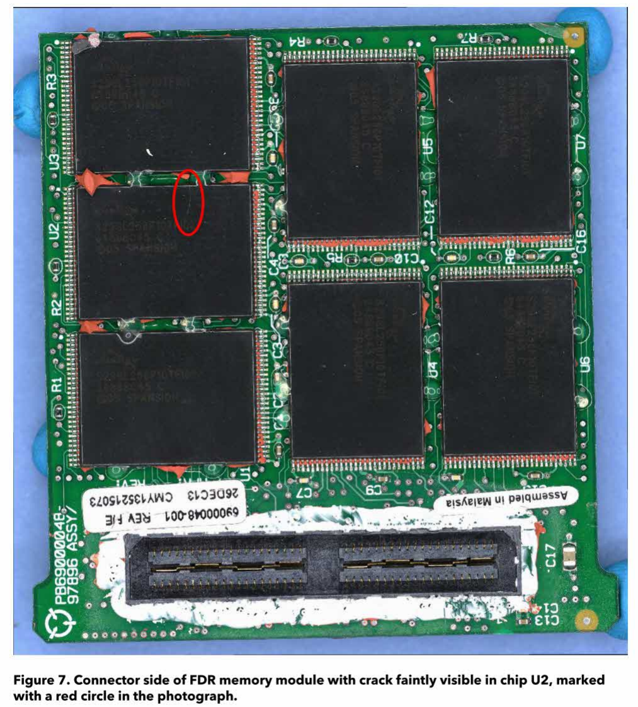
*图7：FDR存储模块连接器侧，U2芯片处可见轻微裂纹（红圈标注）*

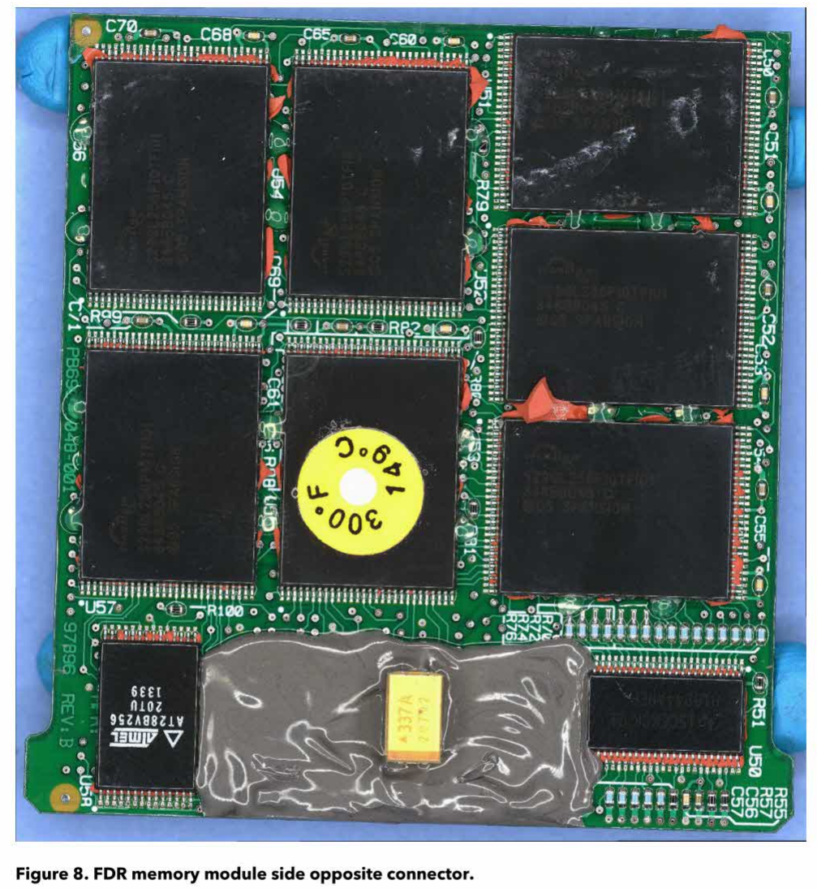
*图8：FDR存储模块连接器相对侧*

在多个FLASH模块之间的环氧连接区域还发现了额外的轻微封装裂纹。这包括FLASH模块U1与U2、U5与U7以及U51与U52之间的轻微裂纹。存储模块两侧的大多数环氧连接均表现出断裂迹象。图9展示了芯片U1与U2之间环氧连接裂纹的一个示例。

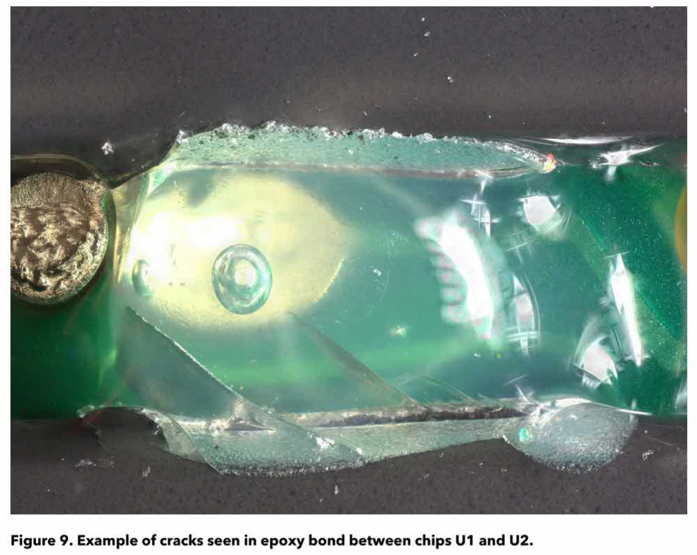
*图9：芯片U1与U2之间环氧连接裂纹示例*

对FDR模块进行了X射线检查，以评估光学检查无法发现的损伤。这类损伤可能包括器件封装内部的键合线断裂、芯片框架损伤或芯片硅片损伤。本次检查未发现其他额外损伤。

在发现芯片级裂纹以及使用DLDR芯片级恢复工具下载结果的表现后，团队对采用其他常规下载方法获取数据的完整性产生了担忧。经人员讨论后认为，恢复任何残存数据的最安全方法是拆除包含飞行数据的各个FLASH存储器件（芯片），并使用FLASH存储芯片读出器直接读取数据。

从电路板组件上拆除FLASH存储器件是一项技术难度高且具有一定风险的操作。在拆除和读取过程中，芯片可能在物理或电气上受到损伤。为降低风险，NTSB决定使用一块已知完好的替代存储模块作为测试对象，以制定最安全的FLASH芯片拆除和读取流程。

选定了一块合适的NTSB替代测试样件，并首先使用DLDR工具对其存储数据进行下载。这样可以在芯片从电路板上拆除前，将DLDR生成的芯片镜像与后续使用FLASH芯片读出器/编程器生成的镜像进行直接对比。如存在差异，则可以对两种读取方法之间的差异进行分析并加以修正。

NTSB电子专家在对测试样件进行操作前，先去除了FLASH存储芯片引脚上的所有三防涂层，以便后续从PCB上进行脱焊操作。随后手动移除了各芯片之间的所有环氧连接。在使用自动化设备之前，先进行了一次手工去焊处理，以降低拆除芯片时的应力。预计在芯片与PCB接触面下方仍可能残留RTV密封胶、三防涂层和环氧材料。

随后为Finetech FinePlacer微电子工作站制定了一套芯片拆除工艺参数，具体包括以下步骤：

1. 将整个电路板加热至低于制造商所用焊料熔点的某一平衡温度；
2. 通过专用芯片喷嘴对存储芯片引脚加热，以安全的升温速率升至焊料熔化温度；
3. 在焊料完全熔化后，通过吸附方式将芯片从PCB上提起并移除。

在HFR5存储板上共有14个FLASH存储芯片，电路板两侧各7个。然而在FDR应用（HFR5-D）中，仅有6个芯片（U1、U2、U3、U4、U5和U6）用于存储飞行数据。首次测试中，从测试样件上拆除了芯片U7。Finetech拆除工艺首次尝试即取得良好效果，芯片顺利拆除。

在成功拆除U7后，随后使用相同工艺依次拆除了测试样件中用于存储飞行数据的6个芯片。在部分情况下，由于芯片下方残留密封材料，需要施加额外力才能将芯片从电路板上移除。每个芯片拆除后均进行清洁处理，并去除残余焊料。随后将芯片放入Xeltek SP-6100 FLASH存储读写器/编程器对应的插座中，通过计算机进行数据读取。

通过芯片读出器生成的芯片镜像与DLDR工具生成的原始芯片镜像进行对比，发现二者在字节交换后完全一致。这是因为DLDR工具生成的是大端格式（Big Endian，Intel格式）的二进制芯片镜像，而芯片读出器生成的是小端格式（Little Endian，Motorola格式）的镜像。由于Honeywell的CHIPS工具支持读取两种格式的数据，因此这一差异不会影响后续处理。

作为最终验证，分别基于DLDR生成的芯片镜像和存储读写器生成的芯片镜像生成了DLU文件。两者被判定在功能上完全一致，从而验证了用于事故存储模块的“芯片拆除（chip-off）下载与数据恢复”流程的有效性。

经CAAC许可，开始采用在测试样件上建立的相同流程对事故模块进行数据恢复。首先通过去除三防涂层和环氧材料来准备芯片拆除。与之前相同，在放入FinePlacer设备之前先手工去除多余焊料。使用Finetech FinePlacer进行芯片拆除过程对所关注的6个芯片均顺利完成。

对芯片U2（封装存在可见裂纹的芯片）的检查发现，其底部除先前观察到的裂纹外，还存在裂纹网络。其他芯片在从电路板上拆除后未发现额外损伤。图10展示了芯片U2从电路板拆除后的底部情况。

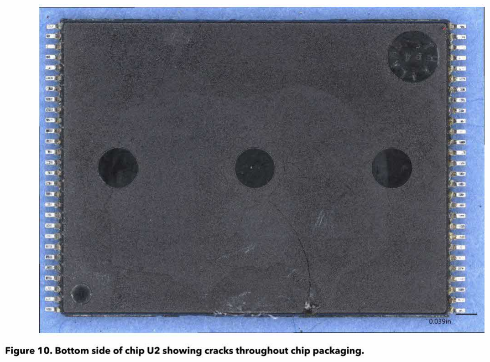
*图10：芯片U2底部，显示封装中存在广泛裂纹*

使用Xeltec存储读写器对各芯片进行读取，结果显示U1、U3、U4、U5和U6的二进制镜像中均包含数据。芯片U2无法读取，Xeltec报告了大量引脚检测错误，并提示多个引脚存在短路情况。这表明芯片内部硅片存在严重损伤。

随后对芯片U2进行了X射线和CT扫描，并对芯片U4进行了X射线检查作为对照样本。CT扫描结果噪声较大，未提供新的信息。在二维X射线图像中，可以观察到部分在封装底部肉眼可见的裂纹。这些裂纹穿过包含芯片内部电路的硅片区域。另有部分底部裂纹在X射线图像中不可见，因为其走向与芯片制造过程中用于固定硅片的X形铜基板轮廓一致。该程度的严重损伤导致U2中的数据无法恢复。

创建了一个由十六进制“FF”（二进制“1”）组成的占位文件，并在Honeywell CHIPS工具中用其替代U2芯片镜像以生成FDR的DLU文件。随后将生成的DLU文件导入NTSB的CIDER数据分析应用中，并结合飞机制造商提供的信息对数据进行分帧处理。

在完成分帧后，由于在CHIPS生成DLU时缺少U2芯片导致指针信息丢失，事故数据被定位在数据流的中部。随后对转换后的数据进行了手动重排，将事故飞行数据移动至记录末尾。

由于缺失芯片镜像，整个数据文件中存在规律性的数据丢失。这符合HFR5-D在六个芯片之间交错写入飞行数据的方式。飞行数据流以条带形式依次写入各个芯片。在本例中，每秒512个数据字，每个芯片约记录1.3秒的数据。因此，最终重构的数据流（缺失U2）应表现为约6.5秒有效数据后接约1.3秒来自U2的数据缺失间隔。

然而在分析软件中初始重构时，数据间隔明显大于预期的1.3秒，约为4秒左右。这种错误的时间间隔使数据时间序列失效，无法与CVR事件对齐。

分析发现，由于缺失数据跨越子帧边界，分析软件在期望连续子帧同步字的情况下，会自动填充错误的额外子帧。当处理替代U2的占位数据时，同步信息丢失，从而导致软件在大约每8个子帧（秒）中插入约4个完整的额外子帧。

纠正这些多余子帧是一项极其耗时的工作。为准确对齐数据，需要逐个检查数据流中的每一个间隙和子帧边界，手动标记每次U2数据丢失的起止位置，并补充缺失的子帧同步边界。这使得回放软件能够保持数据流同步并显示正确的时间。

由于时间修正工作耗时巨大，仅对事故飞行记录中最后12分钟的数据进行了时间精确修正。此外，还对前一段着陆和滑行的部分数据进行了修正，以辅助验证各个参数的准确性。

参数验证是评估各个参数是否由数据系统正确、准确记录的过程，同时用于检查工程单位的比例系数和偏移量是否正确。在该Boeing数据帧中记录的超过1000个参数中，约有150个参数被确认有效。验证重点包括反映飞机加速度、位置、高度、姿态和速度的基本参数，与飞行控制系统、操纵面及控制力相关的参数，以及与发动机运行相关的参数。已验证参数列表见附录B。

FDR数据在飞机仍处于飞行状态时结束。数据终止时飞机处于约26000英尺的下降过程中，未记录后续下降及最终事故过程。对飞行数据提前结束原因的分析表明，在29000英尺巡航过程中，两台发动机的N2转速迅速下降至发电机脱网阈值以下。FDR不具备电池备份，因此在失去飞机发电机供电后即会断电停止工作。这一点不同于CVR，后者具有电池备份，在发电机失效后仍可继续记录至少10分钟。进一步分析发动机N2转速下降的原因发现，在29000英尺巡航期间，两台发动机的燃油开关从“运行（run）”位置移动至“切断（cutoff）”位置，随后发动机转速下降。

### 2.3提供给CAAC的FDR数据（FDR Data Provided to CAAC）

提供给CAAC代表团的FDR数据包括以下内容：

- 所有原始芯片下载镜像文件，包括用于生成FDR`.dlu`文件的U2占位文件  
- 所有由Honeywell CHIPS工具生成的FDR`.dlu`文件，包括在处理过程中选择跳过存储器中已擦除块以及保留已擦除块两种方式生成的文件  
  - 两种方式生成的文件在功能上完全一致。在NTSB数据分析工具中使用的是“跳过已擦除块”的版本，因为该方式最接近Playback32生成`.dlu`文件的行为  
- 所有由NTSB的CIDER FDR分析软件生成的解包二进制文件  
- 手动修正后的解包二进制文件，这些文件对记录中最后12分钟的数据进行了时间对齐修正  
- 已验证数据的曲线图，包括飞机基本参数、飞行控制、控制力以及发动机参数的曲线  
  - 曲线分别覆盖了记录的最后10分钟和最后100秒时间范围  
- 所有已验证参数的表格数据，包括精确采样时间以及按最接近1/16秒对齐的数据  
- 用于在CAAC的FDR分析软件中生成数据帧的全部必要文件  
- 在数据恢复过程中获取的所有FDR电路板图像、扫描图像和显微照片  

NTSB保留了上述FDR文件的副本，以便在最终报告编制过程中协助CAAC还原飞行历史和事故过程。

提交人：  
Charles Cates  
机械工程师 / 记录器专家 

### 2.3.1 FDR数据图（FDR Plots）

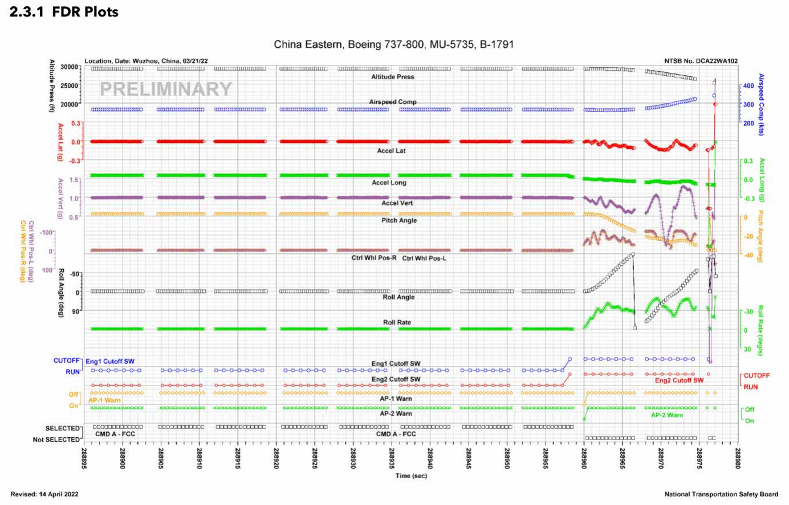
*图11：记录最后90秒的飞机基本参数*

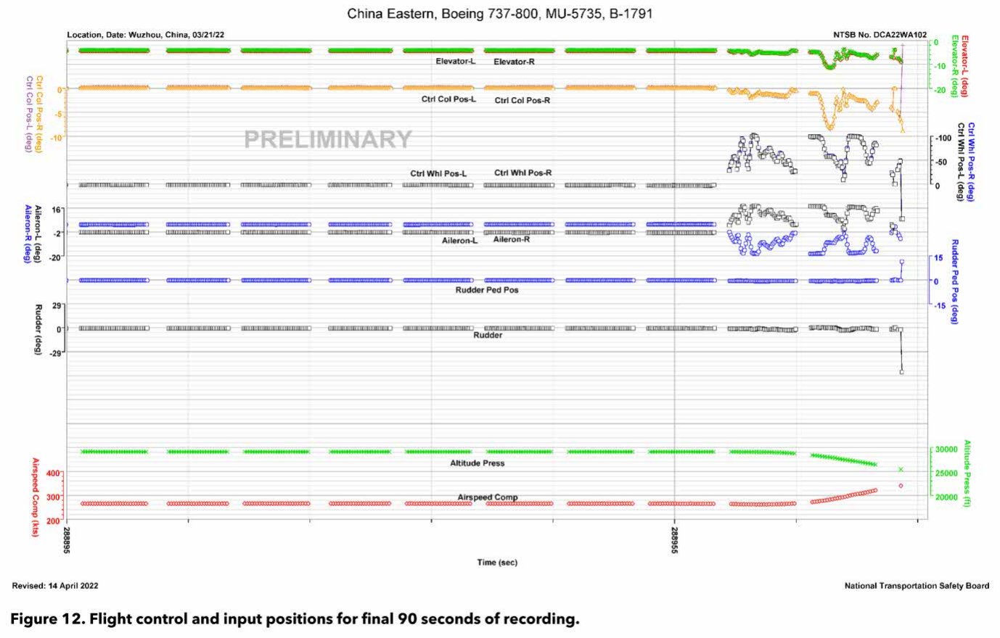
*图12：记录最后90秒的飞行控制与输入位置*

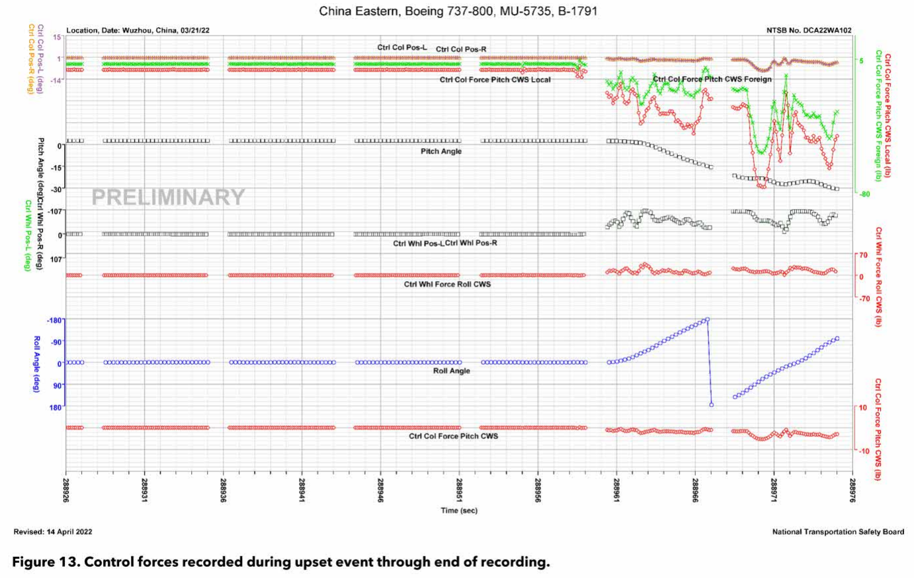
*图13：异常飞行过程至记录结束期间记录的控制力*

## 附录A. 驾驶舱语音记录器音频质量评级标准（CVR QUALITY RATING SCALE）

驾驶舱语音记录器信息的记录质量等级依据以下特征进行划分：

- **优秀（Excellent Quality）**：几乎所有机组对话均可被准确且清晰地理解。生成的记录文本中通常仅有一到两个词无法辨识。记录中的任何缺失通常归因于驾驶舱内通信与无线电通信同时进行而相互遮蔽。

- **良好（Good Quality）**：大部分机组对话可被准确且清晰地理解。生成的记录文本中可能包含若干无法辨识的词语或短语。记录中的缺失通常归因于轻微的技术缺陷、记录系统的短暂中断，或大量同时发生的驾驶舱/无线电通信相互遮蔽。

- **中等（Fair Quality）**：大多数机组对话可以辨识。生成的记录文本中可能包含部分对话无法辨识或出现断裂的情况。这类记录通常由驾驶舱噪声掩盖语音信号的部分内容，或CVR系统轻微的电气或机械故障导致音频信息失真或被遮蔽所引起。

- **较差（Poor Quality）**：需要采用非常规手段才能使部分机组对话可被理解。生成的记录文本可能包含零散的词组和对话，并可能存在大段缺失或无法辨识的内容。这类记录通常由较高的驾驶舱噪声与较低的语音信号（信噪比较低）共同作用，或CVR系统的机械或电气故障严重干扰音频信息所致。

- **不可用（Unusable）**：可以辨认出存在机组对话，但无论采用常规还是非常规手段，均无法形成有意义的对话记录文本。这类记录通常由CVR系统几乎完全的机械或电气故障导致。

## 附录B. 已验证参数（Validated Parameters）

> *说明：本节尚未翻译*  
