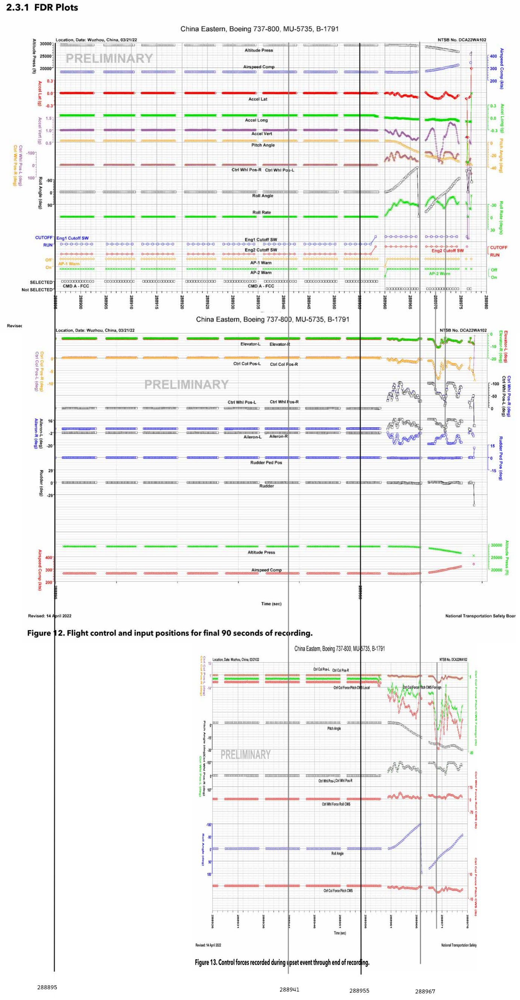
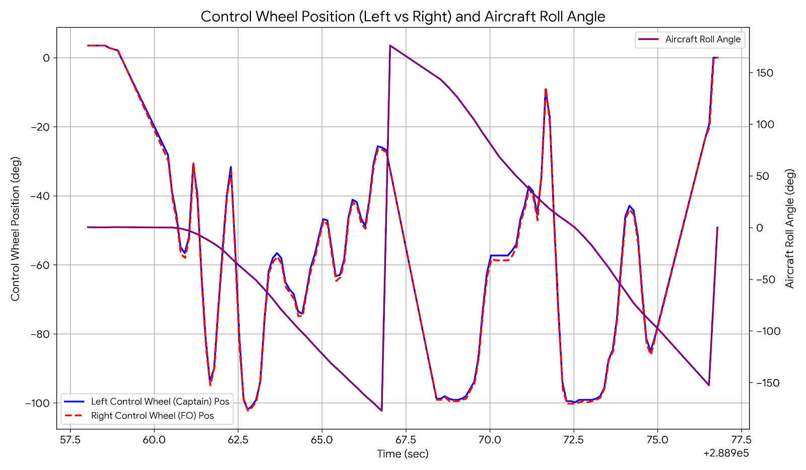
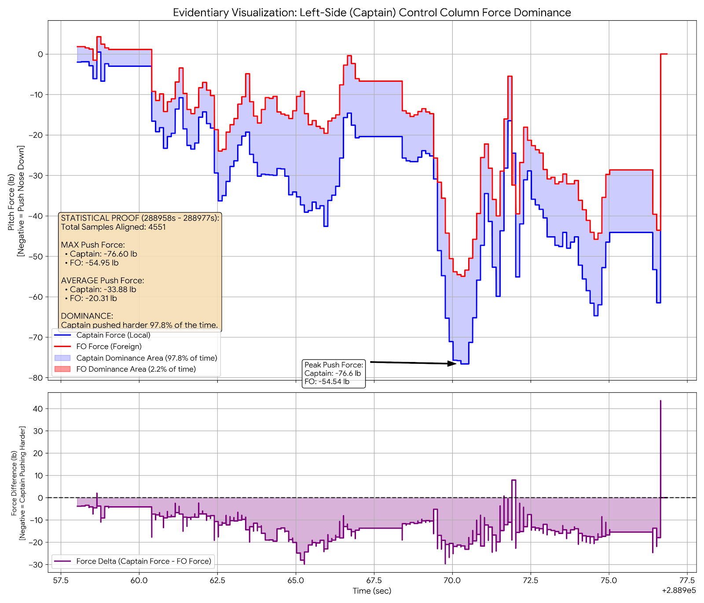
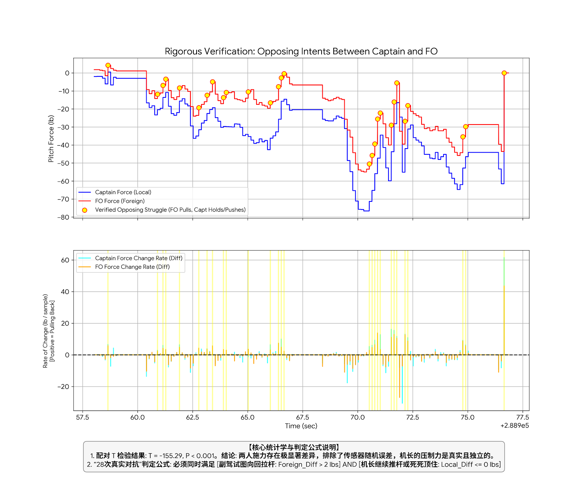
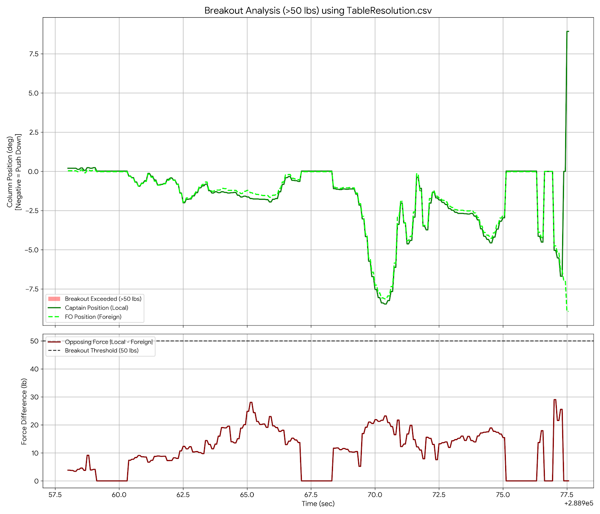

# Issue #9 操纵输入讨论汇总

以下内容整理自社区对公开 CSV 数据、FDR 参数和相关图表的讨论。该部分属于基于公开数据的社区分析与推断，不代表 NTSB、CAAC 或本仓库的调查结论。

## 时间轴对齐图

社区成员将三张图按照时间轴对齐，便于对照分析不同参数在同一时间窗口内的变化。

## Local 操纵输入含义的推断

讨论中提到，从 CSV 数据可见 `LOCAL LIMITED MASTER FCC-L: SET`、`LOCAL LIMITED MASTER FCC-R: Not SET`。据此有社区成员推断，`Local` 记录的可能是机长侧操纵杆的推拉力。结合绘图结果，讨论者认为机长侧出现了推杆操作；横滚操作也可能来自同一侧。由此提出的主要疑点是：为什么会由机长侧进行这些操作。

## 推杆方向与恢复阶段讨论

后续讨论中，有成员补充说明其此前误以为负值代表拉杆；在重新理解参数方向后，认为在一度恢复正飞附近仍出现推杆操作，会显著增加恢复难度。

## 双侧操纵对抗的可能性

另有讨论者使用 AI 对相关曲线进行求导分析，认为数据中存在操纵对抗迹象。该结论仍属于社区分析，应结合原始数据和飞机系统资料谨慎理解。

## 737-800 操纵脱开机制讨论

讨论中还提到，737-800 具有 `Elevator Control Column Override Mechanism` 和 `Aileron Transfer Mechanism`。当两侧操纵力差异达到一定阈值时，相关机构可能脱开：俯仰通道对抗时，机长驾驶杆可能只连接并控制左侧升降舵，副驾驾驶杆可能只连接并控制右侧升降舵；横滚通道对抗时，机长侧可能控制副翼，副驾侧可能控制飞行扰流板。该机制原本用于防止一侧驾驶杆卡阻，讨论中提到的阈值约为 50 磅。社区根据数据推测，两侧连接可能已经发生彻底断开。

来源：[GitHub issue #9 讨论](https://github.com/wrongly-cuddly-obsession/NTSB_FOIA_MU5735/issues/9)
